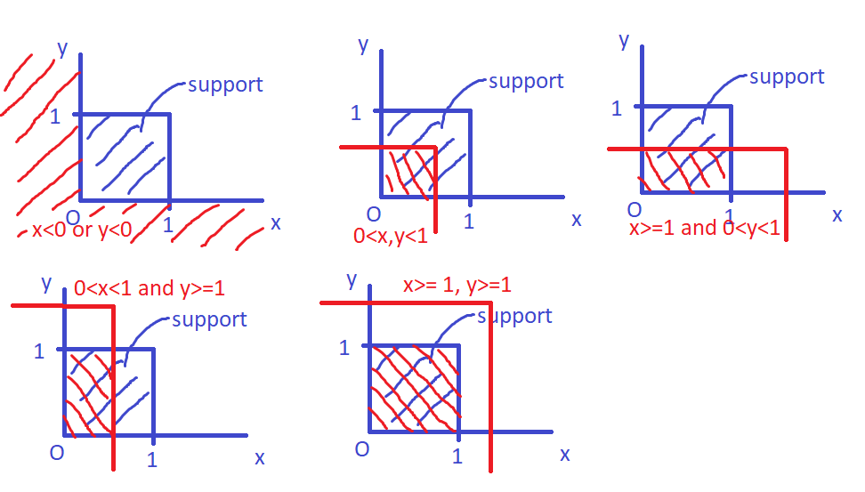

```{r}
# Preliminaries
rm(list=ls())
```

1. A low pressure system (low) that forms in the Australian region has a chance of 8% to
    transform into a tropical cyclone.  
(a) Assume that 20 lows will form in April 2019. Find the probability that two of
them will transform into a tropical cyclone.  
Let X: number of lows that transform into a tropical cyclone (out of 20 lows) ~ Bi(n=20, p=0.08)  
**P(X = 2)**
```{r}
n <- 20
p <- 0.08
dbinom(2, size=n, prob=p)
```

(b) Find the probability that the first low that will transform into a tropical cyclone
in November 2019 will be the 5th low that will form in this month.  
Let Y: number of lows until first low that transforms into a tropical cyclone ~ Geom(p=0.08)  
**P(Y = 5)**
```{r}
p <- 0.08
k <- 5 # number of trials until first success
dgeom(k-1, prob=p)
```

(c) Find the probability that the second low that will transform into a tropical cyclone
in December 2019 will be the 15th low that will form in this month.  
P(2nd low that turns into cyclone is 15th low) = P(1 low turns into cyclone out of 14 lows and 15th low turns into cyclone)
Let X: number of cyclones formed from 14 lows ~ Bi(n=14, p=0.08)
Y: indicator for whether or not a low turns into cyclone ~ Ber(p=0.08)
$$
P(X=14 \cap Y=1) = P(X=14) P(Y=1) \text{ (assuming independence between formation of cyclone from each low)}
$$
```{r}
n <- 14
p <- 0.08
k <- 1
dbinom(k, size=n, prob=p) * p
```

(d) How many lows are expected to form before two of them transform to tropical
cyclones?  
Let Z: number of lows formed before 2 of them transform to cyclones (or until 2nd cyclone)
$$
Z = Z_1 + Z_2
$$
where:
$Z_1$: number of lows until 1st cyclone ~ Geom(p=0.08)
$Z_2$: number of lows from 1st cyclone to 2nd cyclone ~ Geom(p=0.08)
$$
E(Z) = E(Z_1) + E(Z_2) = 2E(Z_1)
$$
```{r}
p <- 0.08
2 * 1/p
```

(e) Assume that 150 lows in total will form between November 1st, 2019 and April
30th, 2020. Find the probability that at least 10 of them will transform into
tropical cyclones.  
- Compute the exact probability  
Let W: number of cyclones formed out of 150 lows ~ Bi(n=150, p=0.08)  
$$
P(W \geq 10) = 1 - P(W \leq 9) = 1 - F_W(9)
$$
```{r}
n <- 150
p <- 0.08
k <- 9
1 - pbinom(k, size=n, prob=p) 
```

- Compute this probability using the Poisson approximation  
W ~ Poiss($\lambda$)  
where: $\lambda$ = np = 150 * 0.08  
**P(W >= 10)**  
```{r}
lambda <- 150 * 0.08
k <- 9
1 - ppois(k, lambda=lambda)
```

2. The telephone calls received by a call center follow a Poisson process with the rate of
8 calls per minute.  
```{r}
call_rate <- 8 # per minute
```
(a) Find the probability that the call center receives exactly 45 calls in 5 minutes.  
X: number of calls in 5 minutes ~ Poiss($\lambda = 8*5$)  
**P(X=45)**  
```{r}
lambda <- 5 * call_rate
k <- 45
dpois(k, lambda=lambda)
```

(b) Find the probability that the call center receives at least 500 calls in one hour
and at most 500 calls in the following hour.  
Y: number of calls in an hour (60 minutes) ~ Poiss($\lambda = 60*8$)  
**Probability of interest** = P(Y >= 500) P(Y <= 500) = (1 - P(Y <= 499)) P(Y <= 500)  
```{r}
lambda <- 60 * call_rate
k1 <- 499
k2 <- 500
(1 - ppois(k1, lambda=lambda)) * ppois(k2, lambda=lambda)
```

(c) How many calls the call center is expected to receive in 8 hours? Find the standard
deviation of the number of calls received in 8 hours.  
Z: number of calls in 8 hours ~ Poiss($\lambda = 8*60*8$)  
**E(Z)** = $\lambda$  
**Standard deviation** = $\sigma = \sqrt{\lambda}$  
```{r}
lambda <- 8 * 60 * call_rate
"Expected value"
lambda
"Standard deviation"
sqrt(lambda)
```

(d) Assume now that the call center cannot receive more than 10 calls in 1 minute due
to limited capacity. If more calls arrive, then some of them will not be answered.
Find the probability that all calls will be answered in 10 minutes. Find the mean
of the time (in minutes) to the first unanswered call.  
W: number of calls in 1 minute ~ Poiss($\lambda = 8$)  
**P(all calls will be answered in 10 minutes)** = P(Number of calls in 1st minute <= 10) P(Number of calls in 2nd munite <= 10) ... P(Number of calls in 10th minute <= 10)  
= $\big( P(W \leq 10) \big)^{10}$  
```{r}
lambda <- call_rate
k <- 10
(ppois(k, lambda=lambda))^10
```
P(first unanswered call arrives in each minute)  
= P(time to 11th call <= 1 minute)  
= 1 - P(time to 11th call > 1 minute)  
= 1 - P(10 calls or less in 1 minute)  
= 1 - P(W <= 10)
= p  
K: number of minutes to the first unanswered call ~ Geom(p)  
**E(K)** = $\frac{1}{p}$  
```{r}
lambda <- call_rate
k <- 10
p <- 1 - ppois(k, lambda=lambda)
1/p
```

3. A random variableXhas a pdf given by  
f(x) = {Ce^2 x, x < 0 , Ce−x, x≥ 0.  
(a) Find the normalizing constantC.  
$$
\begin{split}
\int_{-\infty}^{\infty} f(x) dx &= \int_{-\infty}^{0} f(x) dx + \int_{0}^{\infty} f(x) dx \\
&= \int_{-\infty}^{0} Ce^{2x} dx + \int_{0}^{\infty} Ce^{-x} dx \\
&= \frac{1}{2}Ce^{2x}\Big|_{-\infty}^{0} - Ce^{-x}\Big|_{0}^{\infty} \\
&= \frac{1}{2}C + C \\
&= \frac{3}{2}C
\end{split}
$$
Setting $\int_{-\infty}^{\infty} f(x) dx = 1$ yields:  
$$
C = \frac{2}{3}
$$

(b) Find the cdf ofX.  
$$
\begin{align}
F(x) &= \int_{-\infty}^{x} f(x) dx \\
&= \left\{ \begin{array}{cl}
\int_{-\infty}^{x} Ce^{2x} dx & \ ; \ x < 0 \\
\int_{-\infty}^{0} Ce^{2x} dx + \int_{0}^{x} Ce^{-x} dx & \ ; \ x \geq 0 \end{array} \right. \\
&= \left\{ \begin{array}{cl}
\frac{1}{2}Ce^{2x}\Big|_{-\infty}^{x} & \ ; \ x < 0 \\
\frac{1}{2}Ce^{2x}\Big|_{-\infty}^{0} - Ce^{-x}\Big|_{0}^{x} & \ ; \ x \geq 0 \end{array} \right. \\
&= \left\{ \begin{array}{cl}
\frac{1}{2}Ce^{2x} & \ ; \ x < 0 \\
\frac{1}{2}C - C(e^{-x} - 1) & \ ; \ x \geq 0 \end{array} \right. \\
&= \left\{ \begin{array}{cl}
\frac{1}{2}Ce^{2x} & \ ; \ x < 0 \\
-Ce^{-x} + \frac{3}{2}C & \ ; \ x \geq 0 \end{array} \right. \\
&= \left\{ \begin{array}{cl}
\frac{1}{3}e^{2x} & \ ; \ x < 0 \\
-\frac{2}{3}e^{-x} + 1 & \ ; \ x \geq 0 \end{array} \right. \\
\end{align}
$$

(c) Let− 2 < t < 1. FindMX(t) = E(eXt), the moment generating function ofX.  
$$
\begin{split}
M_X(t) = E(e^{Xt}) &= \int_{-\infty}^{\infty} e^{xt} f(x) dx \\
&= \int_{-\infty}^{0} e^{xt} f(x) dx + \int_{0}^{\infty} e^{xt} f(x) dx \\
&= \int_{-\infty}^{0} e^{xt} Ce^{2x} dx + \int_{0}^{\infty} e^{xt} Ce^{-x} dx \\
&= \int_{-\infty}^{0} C e^{(t+2)x} dx + \int_{0}^{\infty} C e^{(t-1)x} dx \\
&= C\frac{1}{t+2}e^{(t+2)x}\Big|_{-\infty}^{0} + C\frac{1}{t-1}e^{(t-1)x}\Big|_{0}^{\infty} \text{ (t+2 > 0, t-1 < 0 for t around 0)} \\
&= C\frac{1}{t+2} - C\frac{1}{t-1} \\
&= C\bigg(\frac{1}{t+2} - \frac{1}{t-1}\bigg) \\
&= \frac{2}{3}\frac{-3}{(t+2)(t-1)} \\
&= -\frac{2}{(t+2)(t-1)}
\end{split}
$$

(d) UseMX(t)to find the mean and variance ofX,E(X)andVar(X).  
$$
\begin{split}
M_X(t) &= \frac{2}{3}\bigg(\frac{1}{t+2} - \frac{1}{t-1}\bigg) \\
&= \frac{2}{3}\Big((t+2)^{-1} - (t-1)^{-1}\Big) \\
\end{split}
$$
$$
\begin{split}
M_X^{'}(t) &= \frac{2}{3}\Big(-(t+2)^{-2} + (t-1)^{-2}\Big) \\
\end{split}
$$
$$
\begin{split}
M_X^{(2)}(t) &= \frac{2}{3}\Big(2(t+2)^{-3} - 2(t-1)^{-3}\Big) \\
\end{split}
$$
**Mean of X**
$$
\begin{split}
E(X) = M_X^{'}(0) &= \frac{2}{3}\Big(-(2)^{-2} + (-1)^{-2}\Big) \\
&= \frac{2}{3}\Big(-\frac{1}{4} + 1\Big) \\
&= \frac{1}{2}
\end{split}
$$
**Variance of X**
$$
\begin{split}
E(X^2) = M_X^{(2)}(0) &= \frac{2}{3}\Big(2(2)^{-3} - 2(-1)^{-3}\Big) \\
&= \frac{2}{3}\Big(\frac{1}{4} + 2\Big) \\
&= \frac{3}{2} \\
\end{split}
$$
$$
\begin{split}
var(X) &= E(X^2) - [E(X)]^2 \\
&= \frac{3}{2} - \bigg(\frac{1}{2}\bigg)^2 \\
&= \frac{5}{4} \\
\end{split}
$$

(e) Find the median ofX.  
$$
\begin{split}
F(x) &= \left\{ \begin{array}{cl}
\frac{1}{3}e^{2x} & \ ; \ x < 0 \\
-\frac{2}{3}e^{-x} + 1 & \ ; \ x \geq 0 \end{array} \right.
\end{split}
$$
Let $x_m$: median of X  
$$
\begin{split}
F(x_m) &= \frac{1}{2}
\end{split}
$$
Substitute x=0 into F(x):  
$$
\begin{split}
F(0) &= \frac{1}{3}
\end{split}
$$
We have:  
$$
\begin{split}
F(x_m) > F(0) \text{ } \bigg(\frac{1}{2} > \frac{1}{3}\bigg) \\
\text{and } F(x) \text{ non-decreasing} \\
\end{split}
$$
This implies:  
$$
x_m > 0 \\
\Rightarrow F(x_m) = -\frac{2}{3}e^{-x} + 1 = \frac{1}{2} \\
\Rightarrow x_m = -log\bigg(\frac{3}{4}\bigg)
$$
```{r}
-log(3/4)
```

4. LetXandYhave the joint pdf defined by  
f(x,y) = {C(x+y), 0 < x < 1 , 0 < y < 1 , 0 , otherwise.  
(a) Find the normalizing constantC.  

$$
\begin{split}
\int_{-\infty}^{\infty}\int_{-\infty}^{\infty} f(x, y) dxdy &= \int_{0}^{1}\int_{0}^{1} f(x, y) dxdy \quad \text{(integrate over support)} \\
&= \int_{0}^{1}\int_{0}^{1} C(x+y) dxdy \\
&= C\int_{0}^{1}\int_{0}^{1} (x+y) dxdy \\
&= C\int_{0}^{1} \Big(\frac{x^2}{2}+yx\Big)\bigg|_0^1 dy \\
&= C\int_{0}^{1} \Big(\frac{1}{2}+y\Big) dy \\
&= C\Big(\frac{1}{2}y+\frac{y^2}{2}\Big)\bigg|_0^1 \\
&= 1
\end{split}
$$
Set $\int_{-\infty}^{\infty}\int_{-\infty}^{\infty} f(x, y) dxdy = 1$:
$$
C = 1
$$

(b) FindF(x,y) = Pr(X < x,Y < y)for anyx,yand computePr(X < 0. 4 ,Y < 0 .6).  
$$
\begin{split}
F(x, y) = Pr(X < x,Y < y) &= \int_{-\infty}^{y}\int_{-\infty}^{x} f(\tilde{x}, \tilde{y}) d\tilde{x}d\tilde{y} \\
\end{split}
$$

**x <= 0 or y <= 0**
$$
F(x, y) = Pr(X < x,Y < y) = 0
$$
**0 < x,y < 1**
$$
\begin{split}
F(x, y) = Pr(X < x,Y < y) &= \int_{0}^{y}\int_{0}^{x} (\tilde{x} + \tilde{y}) d\tilde{x}d\tilde{y} \\
&= \int_{0}^{y} \Big(\frac{\tilde{x}^2}{2}+\tilde{y}\tilde{x}\Big)\bigg|_0^x d\tilde{y} \\
&= \int_{0}^{y} \Big(\frac{x^2}{2}+\tilde{y}x\Big) d\tilde{y} \\
&= \Big(\frac{x^2}{2}\tilde{y}+\frac{x}{2}\tilde{y}^2\Big)\bigg|_0^y \\
&= \Big(\frac{x^2}{2}y+\frac{x}{2}y^2\Big) \\
&= \frac{1}{2}xy(x+y) \\
\end{split}
$$
**x >= 1, 0 < y < 1**
$$
\begin{split}
F(x, y) = Pr(X < x,Y < y) &= \int_{0}^{1}\int_{0}^{y} (\tilde{x} + \tilde{y}) d\tilde{y}d\tilde{x} \\
&= \int_{0}^{1} \Big(\tilde{x}\tilde{y}+\frac{\tilde{y}^2}{2}\Big)\bigg|_0^y d\tilde{x} \\
&= \int_{0}^{1} \Big(\tilde{x}y+\frac{y^2}{2}\Big) d\tilde{x} \\
&= \Big(\frac{\tilde{x}^2}{2}y+\tilde{x}\frac{y^2}{2}\Big)\bigg|_0^1 \\
&= \frac{y}{2}+\frac{y^2}{2} \\
&= \frac{1}{2}y(y+1) \\
\end{split}
$$
**0<x<1, y>=1**
By symmetry,
$$
\begin{split}
F(x, y) = Pr(X < x,Y < y) &= \frac{1}{2}x(x+1) \\
\end{split}
$$
**x>=1, y>=1**
$$
\begin{split}
F(x, y) = Pr(X < x,Y < y) &= 1 \\
\end{split}
$$
**Pr(X < x,Y < y)for any x,y**
$$
\begin{split}
F(x, y) = Pr(X < x,Y < y) &= \left\{ \begin{array}{cl}
0 & \ ; \ x \leq 0 \text{ or } y \leq 0 \\
\frac{1}{2}xy(x+y) & \ ; \ 0 < x,y < 1 \\
\frac{1}{2}y(y+1) & \ ; \ x \geq 1 \text{, } 0 < y < 1 \\
\frac{1}{2}x(x+1) & \ ; \ 0<x<1 \text{, } y \geq 1 \\
1 & \ ; \ x \geq 1 \text{, } y \geq 1 \end{array} \right. \\
\end{split}
$$
**Pr(X < 0. 4 ,Y < 0 .6)**
$$
Pr(X < 0. 4 ,Y < 0 .6) = \frac{1}{2}xy(x+y)\Big|_{x=0.4,y=0.6}
$$
```{r}
1/2 * 0.4 * 0.6 * (0.4+0.6)
```

(c) ComputeμX= E(X),μY= E(Y),σ^2 X= Var(X),σ^2 Y = Var(Y),Cov(X,Y), and
ρ= Cor(X,Y).

5. LetX andY be jointly normal random variables with parametersE(X) = E(Y) =
    0 , Var(X) = Var(Y) = 1, andCor(X,Y) =ρ.  
(a) Findρsuch thatW 1 = 0. 6 X+ 0. 8 Y andW 2 = 0. 8 X+ 0. 6 Y are independent.
(b) FindPr(X < 1 |X=Y)ifρ= 0. 6.


